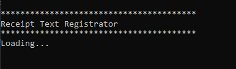
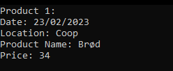
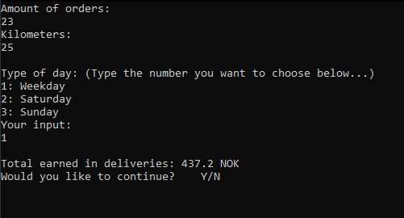

# Orders 
Notes: Best to compile with CMD. All information is stored in .txt files

Instructions of use locally -> javac ProgramInit.java Programs.java -> java ProgramInit.java Programs.java

<h3>Main Menu</h3>

 
<h3>Receipt Register</h3>

 
 
 
 
 
<h3>Order Register</h3>

 
 
<h3>Bill Register</h3>

 
 

